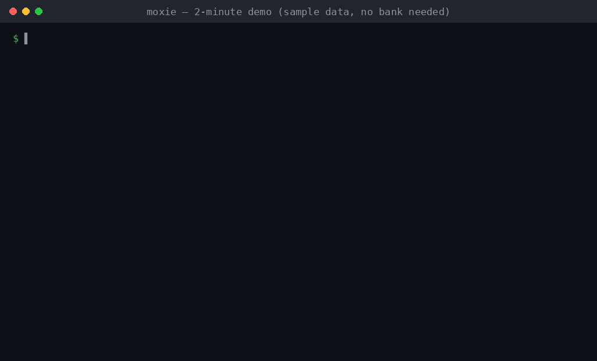

<div align="center">

# 🦡 Moxie

**The open-source money agent that *acts* — and never without your say-so.**

*Moxie doesn't care about a company's excuses. It just gets your money back — and asks you first, every time.*

[](LICENSE)
[](#status)
[](#privacy--security)

*Named for the honey badger — small, fearless, famously relentless. It badgers companies until your money comes back.*



*The whole loop in 30 seconds: **scan** finds ~$591/yr of waste in the sample data, **review** shows you each fix and asks first (that `n` is the point — you're in control), **verify** proves the audit log hasn't been touched. Runs on bundled sample data — no bank, no API key.*

</div>

---

## Why Moxie exists

AI agents today split into two camps: ones that **reach everywhere** (OpenClaw) and ones that **get smarter over time** (Hermes). Neither answers the question that actually matters with your money: *what will you let it do when the downside is real?*

Look at who already touches your money:

- **Receipt & finance organizers** (Expensify, Firefly III, Receiptor AI) — they *file and track*. They don't act.
- **Money-action services** (DoNotPay, Rocket Money, Pine AI) — they *act*, but as **closed black boxes** that have burned users' trust (DoNotPay was FTC-fined for overstating its AI; Rocket Money has acted *as* users without asking).
- **ChatGPT + Plaid** — **read-only by design**: it can spot a subscription to cancel, but it won't cancel it.

**Moxie bridges the gap, trust-first.** It files your receipts (email + photo), reads your accounts, finds waste and wrong charges, and *acts* on them — cancelling, disputing, chasing refunds — but **every action is previewed, approved by you, logged in a tamper-evident audit trail, and backed by the receipt as evidence.** It's open-source and local, so you can read every line and your data never has to leave your machine.

> **Moxie never moves money.** It cancels, disputes, and negotiates on your behalf. Paying, transferring, and trading are deliberately out of scope (that's a licensing and liability minefield). See [the build spec](#design).

---

## What it does

- 🧾 **Receipt vault** — auto-extract receipts from email; snap a photo of a paper receipt → OCR → filed, searchable, encrypted, local.
- 🔎 **Finds problems** — zombie subscriptions, duplicate/wrong charges, missing refunds, gouge renewals.
- ✅ **Acts — with your consent** — drafts the cancellation/dispute, shows it to you, and only sends it when you approve. Receipt attached as proof.
- 🛡️ **Trust Vault** — deny-by-default policy engine, preview/simulate, approval gates, and a **hash-chained, tamper-evident audit log**.
- 🧩 **Community skill library** — reusable "how to cancel with X / dispute with Y" skills, each carrying its own success rate.
- 🔒 **Local-first & BYO key** — runs on your machine with your own LLM API key, or fully offline with a local model.

---

## Quickstart

```bash
# install
git clone https://github.com/JacobBrooke1/moxie.git
cd moxie
pip install -e .          # or: ./install.sh

# try it with built-in sample data — no bank, no API key needed
# (Windows: if `moxie` isn't recognized, pip's Scripts dir isn't on PATH —
#  use `python -m moxie <command>` instead; works everywhere)
moxie init
moxie scan            # finds issues in sample transactions
moxie review          # shows each fix, asks you to approve, then drafts it
moxie log             # the tamper-evident audit trail
moxie verify          # confirms the log hasn't been altered
moxie doctor          # checks your setup: python, key, audit, skills
```

The demo runs entirely on bundled sample data so you can see the consent-first loop end to end before connecting anything real.

> ⚠️ **Status:** early scaffold. The Trust Vault (audit log, policy, approvals) is implemented; Plaid, OCR, and email ingestion are stubbed with clear `TODO`s. **Do not use with real financial data until the items in [SECURITY.md](SECURITY.md) are done.**

---

## How it works

```
CAPTURE receipts (email + photo/OCR)  +  CONNECT accounts (Plaid / CSV, read-only)
   → ORGANIZE   file receipts, match to transactions
   → DETECT     zombie subs, duplicate charges, missing refunds
   → PROPOSE    an action card: "Dispute this $40 double charge? I have the receipt."
   → APPROVE    you confirm  (because it can't be undone)
   → EXECUTE    cancellation / dispute / refund email
   → LOG        append-only, hash-chained audit trail with the receipt attached
```

Nothing in the right-hand column happens without passing the **Trust Vault**. For the full security model — the deny-by-default policy engine, the fail-safe consent design, the hash-chain math, and the threat model — see **[docs/HOW_IT_WORKS.md](docs/HOW_IT_WORKS.md)**.

### Why preview-and-approve, not "undo"

Most money actions are **one-way** — you can't cleanly un-cancel a subscription or un-send a dispute. So Moxie's safety is *before* the action (simulate → approve), not a promise to reverse it after. That's the whole reason consent is mandatory.

---

## Privacy & security

- **Local-first.** Your receipts, transactions, and audit log live on your machine.
- **Bring your own key.** Moxie uses *your* LLM API key, or a **local/offline model** (e.g. Ollama) + **local OCR** (Tesseract) so receipt images never touch a cloud service.
- **Least privilege.** Account access is read-only (Plaid never exposes your credentials to the agent; Moxie never moves money).
- **Tamper-evident.** The audit log is hash-chained — any edit to past entries fails `moxie verify`.

Security is the precondition for everything else here — see [SECURITY.md](SECURITY.md).

---

## Built on the OpenClaw / Hermes ecosystem

Moxie deliberately fits the world it came from, so the plumbing is familiar and only the moat is new:

- **Language & install** — Python (Hermes is ~82% Python), installed via a one-line `curl … | bash` that prefers [`uv`](https://github.com/astral-sh/uv), exactly like Hermes.
- **Skills** — the same `skills/<name>/SKILL.md` convention used by OpenClaw and the [agentskills.io](https://agentskills.io) standard, so skills stay portable and shareable (think ClawHub, but for money-actions).
- **Familiar CLI** — `moxie doctor` and friends echo `hermes doctor` / `openclaw` so anyone from that world feels at home.
- **Sandboxing** — action execution is designed to run sandboxed (Docker by default, as OpenClaw does for untrusted sessions).

What's *not* borrowed is the whole point: the **Trust Vault** (consent-first, tamper-evident) and the money-action layer are ours.

## Contributing

The most valuable contribution is **skills** — encoded know-how for cancelling/disputing with a specific merchant, bank, or service. See [CONTRIBUTING.md](CONTRIBUTING.md) and the example in [`skills/`](skills/).

---

## Design

The security model and architecture rationale live in [docs/HOW_IT_WORKS.md](docs/HOW_IT_WORKS.md) — including why Moxie is standalone rather than a skill inside a general-purpose agent, and exactly what the Trust Vault does and doesn't defend against.

## License

[MIT](LICENSE) — free and open. Use it, fork it, learn from it.
